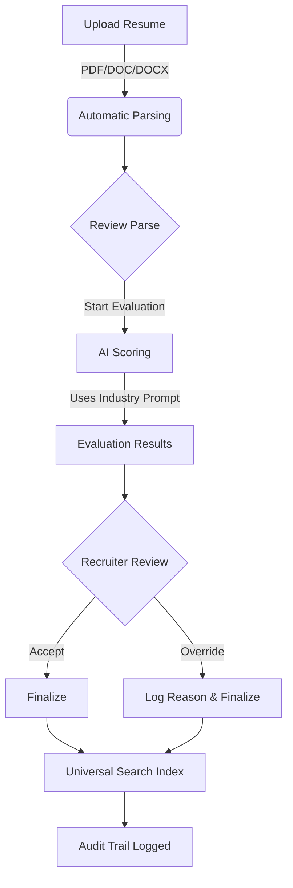

# AI-Driven Holistic Resume Evaluation Platform

A comprehensive, full-stack AI hiring platform that evaluates candidates holistically rather than relying on rigid keyword matching. This platform combines intelligent resume parsing, AI-powered evaluation, and human oversight to revolutionize the recruitment process.

## 🏗️ Project Overview

This is a monorepo containing both frontend and backend applications:

- **Frontend**: Modern React application with Vite, Tailwind CSS, and ShadCN UI
- **Backend**: Node.js/Express API with MongoDB, Redis, and AI integration
- **AI Integration**: Holistic evaluation using advanced language models (OpenAI, Anthropic, Google Gemini)
- **File Processing**: Intelligent parsing of PDF/DOC files with context preservation

## 🚀 Key Features

### 🎯 Holistic Evaluation System
- **Multi-Industry Support**: Configurable evaluation prompts for IT, Healthcare, Finance, Manufacturing, and more
- **Context-Aware Analysis**: AI assesses experience context, project ownership, and domain relevance
- **Explainable AI**: Every score comes with detailed reasoning and evidence highlighting
- **Human-in-the-Loop**: Recruiters can override AI decisions with complete audit trail logging

### 🔒 Authentication & Security
- **Secure Login System**: Password-based authentication (Simplified for development: accepts any credentials)
- **Protected Account Creation**: Administrator password-controlled user registration
- **Instant Access Control**: Wrong passwords result in immediate redirect to login
- **Role-Based Access**: Different permissions for HR professionals and administrators

### 📁 Intelligent Resume Processing
- **Multi-Format Support**: PDF, DOC, and DOCX file parsing
- **Context Preservation**: Maintains semantic meaning during parsing
- **Skill Extraction**: Automatic identification and categorization of technical and soft skills
- **Experience Analysis**: Deep understanding of role progression and project complexity

### 🔍 Universal Search
- **Global File Search**: Instantly find resumes, documents, and folders.
- **Smart Filtering**: Filter results by type (PDF, DOCX, Folder).
- **Quick Navigation**: Jump directly to search results with a single click.

### 🎛️ Comprehensive Management
- **Hiring Forms**: Define role requirements, cut-offs, and evaluation weights
- **Prompt Management**: Configure industry-specific evaluation prompts with version control
- **Audit Trail**: Complete logging system for compliance and accountability
- **Analytics Dashboard**: Real-time insights into evaluation patterns and success metrics

## 🔄 Post-Upload Workflow

Here is exactly what happens after a resume is uploaded:



### 🧠 One-line flow
> "After upload, the resume is parsed, evaluated by AI using role-specific criteria, reviewed by a recruiter, optionally overridden, and fully logged for compliance."

## 🛠️ Technology Stack

### Frontend (frontend/)
- **Framework**: React 19 with Vite
- **Styling**: Tailwind CSS, ShadCN UI
- **Routing**: React Router DOM (v6)
- **UI Components**: Radix UI primitives & ShadCN UI
- **Icons**: Lucide React
- **File Upload**: react-dropzone
- **HTTP Client**: Axios/Fetch
- **State Management**: React Hooks

### Backend (backend/)
- **Runtime**: Node.js 18+ with Express.js
- **Database**: MongoDB with Mongoose ODM
- **Caching**: Redis for session management and performance
- **Authentication**: JWT with refresh tokens
- **File Processing**: Multer, pdf-parse, mammoth
- **Queue System**: Bull for background job processing
- **AI Integration**: Google Gemini API
- **File Storage**: AWS S3 integration
- **Security**: Helmet, CORS, Rate Limiting

## 📦 Installation & Setup

### Prerequisites
- Node.js 18.0.0 or higher
- npm 8.0.0 or higher
- MongoDB 5.0 or higher
- Redis 6.0 or higher

### 1. Clone the Repository
```bash
git clone <repository-url>
cd holisticai-resume-evaluator
```

### 2. Frontend Setup
```bash
cd frontend

# Install dependencies
npm install

# Start development server
npm run dev
```

### 3. Backend Setup
```bash
cd backend

# Install dependencies
npm install

# Configure environment variables (create .env)
# GEMINI_API_KEY=your_key_here
# DATABASE_URL=mongodb://localhost:27017/resume-evaluation
# REDIS_URL=redis://localhost:6379
# PORT=3001

# Start development server
npm run dev
```

## 🗄️ Database Schema

### Core Collections
- **Users**: Authentication, profile management, and role-based access.
- **Resumes**: File metadata, parsed content, and processing status.
- **Evaluations**: AI results, scoring breakdown, and human overrides.
- **Hiring Forms**: Role definitions, criteria, and thresholds.
- **Prompts**: Industry-specific templates and version control.
- **Audit Trail**: Complete action logging for compliance.

## 🚀 Deployment

### Frontend Deployment
The frontend is a static application compatible with Vercel, Netlify, or AWS S3.

```bash
cd frontend
npm run build
```

### Backend Deployment
The backend can be deployed to AWS EC2, Google Cloud, or Heroku. Docker support is included.

```dockerfile
FROM node:18-alpine
WORKDIR /app
COPY package*.json ./
RUN npm ci --only=production
COPY . .
EXPOSE 3001
CMD ["npm", "start"]
```

## 🤝 Contributing

We welcome contributions! Please follow these guidelines:
1. Fork the repository
2. Create a feature branch
3. Commit your changes
4. Push to the branch
5. Open a Pull Request

## 📝 License

This project is licensed under the MIT License.
